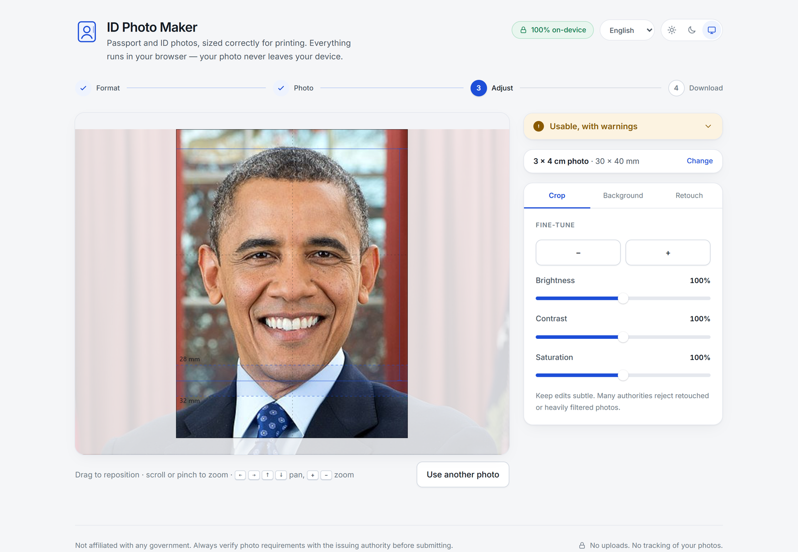
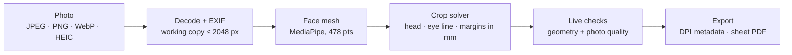

<div align="center">


# ID Photo Maker

**Passport and ID photos in your browser — millimetre-exact, print-ready, and your photo never leaves your device.**

[](https://github.com/hakimiomari/id-photo-maker/releases)
[](https://github.com/hakimiomari/id-photo-maker/actions/workflows/ci.yml)
[](#privacy-by-construction)
[](#quality)
[](#supported-formats)

<picture>
  <source media="(prefers-color-scheme: dark)" srcset="docs/media/editor-dark.png">
  
</picture>

</div>

---

Pick a document format, add a portrait, and download a photo that prints at
exactly the right size — head height, eye line and margins solved automatically
against each country's official specification, then checked live as you adjust.

- **14 document formats** — EU biometric, UK, US, Japan, South Korea, India,
  Canada, China visa, German driving licence, US DV lottery, and generic sizes —
  every dimension read from a [data-driven registry](packages/core/src/formats/formats.json), never a constant.
- **True print size** — exports carry real DPI metadata (JPEG JFIF / PNG pHYs),
  byte-verified in tests, so a 35 × 45 mm photo prints at 35 × 45 mm.
- **Print sheets** — 10 × 15 cm, 13 × 18 cm, A4 and 4 × 6″ with cut marks, as
  PDF or JPEG; family mode lets several people share one sheet.
- **Background removal** — MODNet via ONNX Runtime (WebGPU, WASM fallback) with
  required-colour presets and edge softness, on your device like everything else.
- **Compliance pre-check** — head pose, eyes, expression, exposure, lighting,
  sharpness and background uniformity, plus live camera capture with framing
  guidance and a countdown.
- **Four languages** — English, German, Dari and Pashto, right-to-left where the
  language needs it, in the editor and on 56 static landing pages.
- **Installable PWA** — after one visit, the entire pipeline works offline.

> [!NOTE]
> **Status: public beta** ([v1.0.0-beta.1](https://github.com/hakimiomari/id-photo-maker/releases/tag/v1.0.0-beta.1)).
> The pipeline is complete and tested; what separates beta from stable is listed
> in the [roadmap](#road-to-100) below. Always verify requirements with the
> issuing authority before submitting a photo.

## Privacy, by construction

There is no upload endpoint. Decoding, face detection, cropping, matting and
encoding all run in Web Workers in your browser — and that claim is **enforced
by CI, not just promised**:

- `pnpm lint:privacy` fails the build if any network primitive (`fetch`,
  `XMLHttpRequest`, `WebSocket`, `sendBeacon`…) appears in the core package.
- A strict Content-Security-Policy allows connections only for model files;
  models and runtimes are self-hosted and hash-verified at build time.
- Analytics are cookieless, **off by default**, limited to a CI-enforced
  allowlist of event names, and honour Do Not Track / Global Privacy Control.
- An e2e test replays the whole pipeline with the network disabled.

## Getting started

```bash
corepack enable pnpm
pnpm install
pnpm dev            # http://localhost:3000
```

Face-landmark model files (~7 MB) load from a CDN by default. To self-host them
— required for background removal and the offline PWA:

```bash
pnpm --filter @photomaker/web fetch:models
# then add to apps/web/.env.local:
#   NEXT_PUBLIC_MEDIAPIPE_BASE=/models/wasm
#   NEXT_PUBLIC_MEDIAPIPE_MODEL=/models/face_landmarker.task
```

## How it works



Two pieces matter most:

**The crop solver** ([`cropSolver.ts`](packages/core/src/geometry/cropSolver.ts)).
A photo with the wrong head-height ratio gets an application rejected, so this
file is pure, exhaustively tested, and reads every dimension from the format
registry.

**DPI metadata** ([`export/`](packages/core/src/export)). `canvas.toBlob()`
writes no density information, so a print service would assume 72 DPI and print
a 35 × 45 mm photo about eight times too large. Every export goes through
`encodeCanvas()`, which patches the JPEG JFIF APP0 segment or inserts a PNG
`pHYs` chunk — both verified byte-for-byte in tests.

## Supported formats

| Format | Photo | Head height | Background | Digital file |
|---|---|---|---|---|
| Biometric 35 × 45 (EU) | 35 × 45 mm | 32–36 mm | light grey | — |
| UK passport | 35 × 45 mm | 29–34 mm | light grey | — |
| US passport / visa | 51 × 51 mm | 25–35 mm | white | 600 × 600 px |
| US Green Card lottery (DV) | 51 × 51 mm | 25–35 mm | white | 600 × 600 px |
| Japan passport | 35 × 45 mm | 32–36 mm | white | — |
| South Korea passport | 35 × 45 mm | 32–36 mm | white | — |
| China visa | 33 × 48 mm | 28–33 mm | white | 354 × 472 px |
| India passport | 51 × 51 mm | 30.6–35.7 mm | white | — |
| Canada passport | 50 × 70 mm | 31–36 mm | white | — |
| German driving licence | 35 × 45 mm | 32–36 mm | light grey | — |
| 3 × 4 cm photo | 30 × 40 mm | 28–32 mm | any | — |
| 2 × 3 cm photo | 20 × 30 mm | 21–24 mm | any | — |
| 4 × 6 cm photo | 40 × 60 mm | — | any | — |
| CV / résumé photo | 45 × 60 mm | — | any | — |

Every entry records its official `source_url` and a verification status; the UI
shows a stronger disclaimer for entries no human has re-verified yet.

**Adding a format** is one JSON entry in
[`formats.json`](packages/core/src/formats/formats.json) — no code. A zod
schema in CI rejects self-contradictory entries (head taller than the photo,
inverted ranges, missing source). New entries start as `seeded`; flipping one
to `verified` means a human re-read the official source and confirmed every
number — never automate it.

## Quality

```bash
pnpm test           # 204 unit tests in packages/core
pnpm e2e            # 22 Playwright browser tests
pnpm typecheck
pnpm build
pnpm lint:privacy   # fails if any network primitive appears in packages/core
```

- The full pipeline is e2e-tested in a real browser: sample photo → detection →
  validation → sheet PDF, with the produced PDF byte-verified.
- The offline test loads the app once, kills the network, and runs the entire
  pipeline again from the service-worker caches.
- The camera test feeds Chromium a **fake webcam** (the sample portrait as a
  generated Y4M) and drives live guidance → countdown capture → editor.
- `PW_CHANNEL=chrome pnpm e2e` runs the suite on your system Chrome instead of
  a downloaded Playwright browser.

## Project layout

```
packages/core/          @photomaker/core — framework-agnostic TypeScript
  src/geometry/         crop solver + unit conversions  ← the heart of the product
  src/formats/          formats.json registry + zod schema
  src/compliance/       pre-check: pose, pixel metrics, evaluator
  src/capture/          live camera guidance
  src/segment/          MODNet matting + compositing
  src/retouch/          heal / smooth brushes, attire overlay
  src/sheet/            print-sheet tiler, renderer, PDF builder
  src/export/           encode + JPEG JFIF / PNG pHYs density injection
  src/ingest/ detect/ render/   decode, face mesh, canvas pipeline
  tests/                Vitest — geometry and byte-level metadata tests
apps/web/               Next.js App Router UI
  workers/              detect, segment, precheck, encode Web Workers
  lib/                  zustand store, typed worker protocol, camera, i18n
e2e/                    Playwright suites incl. offline + fake-webcam capture
scripts/                CI privacy gate
```

## Development notes

**Never run `pnpm build` while `pnpm dev` is running.** They share
`apps/web/.next`, and the build deletes the dev server's manifests mid-flight —
the page keeps rendering but goes inert. Fix: remove `apps/web/.next`, restart dev.

**The CSP allows `'unsafe-eval'` in development only.** Next's dev server
compiles modules through `eval()`; a strict CSP kills hydration silently. The
`is hydrated` e2e test guards this class of bug.

**Model loading goes through `importScripts()`** in the worker, governed by
`script-src`, not `connect-src`. Self-hosting the models keeps everything
same-origin.

## Road to 1.0.0

- [ ] Re-verify all 14 formats against their official sources, flip to `verified`
- [ ] Physically measure a print from a drugstore kiosk
- [ ] Device lab: iPhone Safari with a 48 MP photo, mid-range Android
- [ ] Impressum + privacy-policy pages
- [ ] Native-speaker review of the Dari and Pashto copy
- [ ] Lighthouse budgets in CI · fixture suite of ≥ 30 annotated portraits

## Releases

Versions follow [SemVer](https://semver.org); notes live in
[CHANGELOG.md](CHANGELOG.md). Pushing a `v*` tag runs the release workflow:
it re-runs the privacy gate, typecheck and tests, then publishes the matching
changelog section as a GitHub release — betas are marked pre-release
automatically.

---

<div align="center">

Not affiliated with any government. Since 2025, German Personalausweis and
Reisepass photos must be transmitted digitally by a certified provider and
cannot be produced with this app; driving-licence photos are still accepted
on paper.

**[Latest release](https://github.com/hakimiomari/id-photo-maker/releases)** · **[Changelog](CHANGELOG.md)** · **[Report an issue](https://github.com/hakimiomari/id-photo-maker/issues)**

</div>
